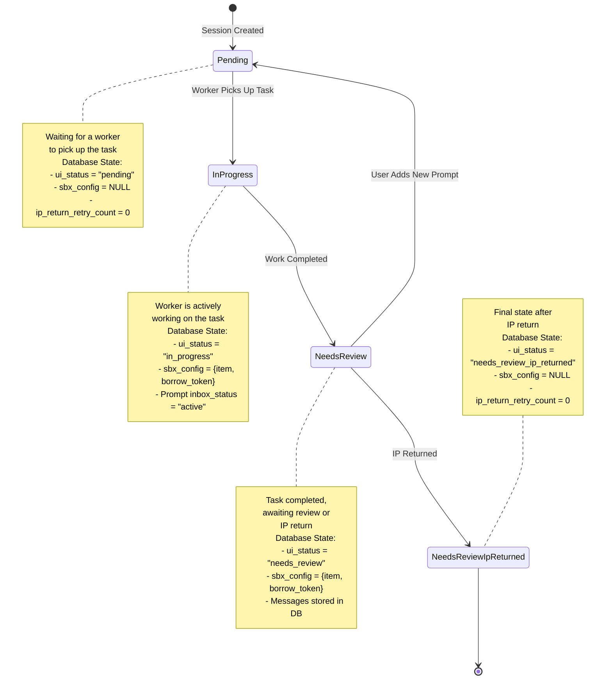

# Session UI Status State Machine

This document describes the state transitions for the `ui_status` field in sessions and their side effects.

## State Diagram



## State Transition Details

### 1. Session Created → Pending

**Trigger:** User creates a new session via API

**Location:** `src/handlers/sessions.rs`
- `create()` function (line ~120-170)
- `create_with_prompt()` function (line ~190-280)

**Database Changes:**
- Session record inserted into `session` table
- `ui_status` = `"pending"`
- `sbx_config` = `NULL`
- `ip_return_retry_count` = `0`
- `branch` = Generated branch name
- `title` = Generated via Anthropic API
- `user_id` = From authenticated user

---

### 2. Pending → InProgress

**Trigger:** Prompt poller detects pending prompt and borrows IP

**Location:** `src/bg_tasks/prompt_poller.rs`
- `poll_and_enqueue_prompts()` function (line ~38-127)

**Database Changes:**
- **session table UPDATE:**
  - `ui_status` = `"in_progress"`
  - `sbx_config` = JSON object with borrowed IP:
    ```json
    {
      "item": {
        "mcp_json_string": "...",
        "api_url": "...",
        ...
      },
      "borrow_token": "token-string"
    }
    ```
  - `updated_at` = Current timestamp
- **prompt table UPDATE:**
  - `inbox_status` = `"active"` (changed from `"pending"`)
  - `updated_at` = Current timestamp

**External API Calls:**
- IP Allocator: `POST /handlers/ip/borrow` - Borrows sandbox IP
- Job Queue: Prompt enqueued to Apalis PostgreSQL queue

---

### 3. InProgress → NeedsReview

**Trigger:** Outbox publisher completes Claude Code CLI execution

**Location:** `src/bg_tasks/outbox_publisher.rs`
- `process_outbox_job()` function (line ~27-550)
- State update in spawned async task (line ~430-470)

**Database Changes:**
- **session table UPDATE:**
  - `ui_status` = `"needs_review"`
  - `sbx_config` = UNCHANGED (still contains borrowed IP)
  - `updated_at` = Current timestamp
- **message table INSERTs:**
  - Multiple message records created from Claude Code CLI output
  - Each message linked to prompt via `prompt_id`
  - `data` = JSON output from Claude CLI (stream-json format)

**Process Flow:**
1. Claude Code CLI runs in sandbox (via MCP)
2. Output streamed and parsed line-by-line as JSON
3. Each JSON line inserted as message record
4. On completion, session updated to NeedsReview
5. IP remains borrowed (poller will handle return)

---

### 4. NeedsReview → Pending

**Trigger:** User adds a new prompt to the session (prompt again)

**Location:** `src/handlers/prompts.rs`
- `create()` function (line ~79-123)
- State check and update (line ~95-106)

**Database Changes:**
- **session table UPDATE:**
  - `ui_status` = `"pending"` (only if current status is `"needs_review"`)
  - `sbx_config` = UNCHANGED (will be overwritten when new IP borrowed)
  - `updated_at` = Current timestamp
- **prompt table INSERT:**
  - New prompt record created
  - `inbox_status` = `"pending"`
  - `session_id` = Parent session ID
  - `data` = User's prompt content

**Note:** This transition allows users to iterate on their work by adding follow-up prompts. The old IP will be replaced when the new prompt is picked up by the poller.

---

### 5. NeedsReview → NeedsReviewIpReturned

**Trigger:** IP return poller successfully returns the IP

**Location:** `src/bg_tasks/ip_return_poller.rs`
- `poll_and_return_ips()` function (line ~28-197)
- Success path (line ~103-123)

**Conditions:**
- Session has `ui_status IN ("needs_review", "archived")`
- Session has non-null `sbx_config`
- Not already in dead letter queue

**Database Changes:**
- **session table UPDATE:**
  - `ui_status` = `"needs_review_ip_returned"`
  - `sbx_config` = `NULL` (cleared after successful IP return)
  - `ip_return_retry_count` = `0` (reset)
  - `updated_at` = Current timestamp

**External API Calls:**
- IP Allocator: `POST /handlers/ip/return` - Returns borrowed IP
  - Request includes `item` and `borrow_token` from sbx_config

**Error Handling:**
- **On IP return failure:**
  - `ip_return_retry_count` incremented (not reset)
  - Session remains in NeedsReview state
  - `sbx_config` retained for retry
- **After 5 failed attempts (MAX_RETRY_COUNT):**
  - Session moved to `dead_letter_queue` table
  - `ip_return_retry_count` = 5
  - DLQ entry includes error message and original sbx_config

---

### 6. Manual State Updates (via API)

**Trigger:** Administrator manually updates session via API

**Location:** `src/handlers/sessions.rs`
- `update()` function (line ~340-400)

**Database Changes:**
- **session table UPDATE:**
  - `ui_status` = Any valid UiStatus value (if provided)
  - Any other session fields can be updated
  - `updated_at` = Current timestamp

**Use Cases:**
- Manual intervention for stuck sessions
- Testing and debugging
- Administrative operations

**Note:** If a session is manually set to "archived" or any other state while still having a non-null `sbx_config`, the IP return poller will still attempt to return the IP. The poller queries for sessions with `ui_status IN ("needs_review", "archived")` AND `sbx_config IS NOT NULL`, so it will catch manually archived sessions with unreturned IPs.

---

## Implementation Files

| Component | File | Responsibility |
|-----------|------|----------------|
| Entity Definition | `src/entities/session.rs` | Defines `UiStatus` enum (5 states) and session model |
| Session Handlers | `src/handlers/sessions.rs` | Creates sessions, handles updates |
| Prompt Handlers | `src/handlers/prompts.rs` | Creates prompts, triggers Pending transition |
| Prompt Poller | `src/bg_tasks/prompt_poller.rs` | Transitions Pending → InProgress |
| Outbox Publisher | `src/bg_tasks/outbox_publisher.rs` | Transitions InProgress → NeedsReview |
| IP Return Poller | `src/bg_tasks/ip_return_poller.rs` | Transitions NeedsReview → NeedsReviewIpReturned |
| DLQ Service | `src/services/dead_letter_queue.rs` | Handles failed IP returns |

---

## Database Schema

### UiStatus Enum Values

Defined in `src/entities/session.rs`:

```rust
pub enum UiStatus {
    #[sea_orm(string_value = "pending")]
    Pending,
    
    #[sea_orm(string_value = "in_progress")]
    InProgress,
    
    #[sea_orm(string_value = "needs_review")]
    NeedsReview,
    
    #[sea_orm(string_value = "needs_review_ip_returned")]
    NeedsReviewIpReturned,
    
    #[sea_orm(string_value = "archived")]
    Archived,  // Legacy, may still exist in database
}
```

### Session Table Fields

| Field | Type | Nullable | Description |
|-------|------|----------|-------------|
| `id` | UUID | No | Primary key |
| `ui_status` | String(50) | No | Current state (default: "pending") |
| `sbx_config` | JSONB | Yes | Borrowed IP configuration |
| `ip_return_retry_count` | Integer | No | Retry attempts for IP return (default: 0) |
| `parent` | UUID | Yes | Parent session ID |
| `branch` | String | Yes | Git branch name |
| `repo` | String | Yes | GitHub repository (owner/name) |
| `target_branch` | String | Yes | Target branch for PR |
| `title` | String | Yes | Session title |
| `user_id` | String | No | Owner user ID |
| `created_at` | Timestamp | No | Creation timestamp |
| `updated_at` | Timestamp | No | Last update timestamp |
| `deleted_at` | Timestamp | Yes | Soft delete timestamp |

### Related Tables

**prompt table:**
- `id` (UUID): Primary key
- `session_id` (UUID): Foreign key to session
- `data` (JSONB): Prompt content
- `inbox_status` (String): "pending" or "active"
- `created_at`, `updated_at`: Timestamps

**message table:**
- `id` (UUID): Primary key
- `prompt_id` (UUID): Foreign key to prompt
- `data` (JSONB): Claude Code CLI output
- `created_at`, `updated_at`: Timestamps

**dead_letter_queue table:**
- `id` (UUID): Primary key
- `source` (String): "ip_return_poller"
- `session_id` (UUID): Related session
- `retry_count` (Integer): Number of failed attempts
- `error_message` (Text): Last error
- `original_data` (JSONB): Original sbx_config
- `created_at`, `updated_at`: Timestamps

## Database Migrations

The `ui_status` field was added via migration:
- **File:** `migration/src/m20251107_000004_add_ui_status_to_session.rs`
- **Default Value:** `"pending"`
- **Type:** String (max 50 chars)
- **Not Null:** Yes

Previous fields `session_status` and `status_message` were removed via:
- **File:** `migration/src/m20251107_000005_drop_session_status_fields.rs`

---

## Background Task Schedule

| Task | Interval | Statuses Monitored |
|------|----------|-------------------|
| Prompt Poller | Every 1 second | Prompts with `inbox_status = Pending` |
| Outbox Publisher | On-demand (job queue) | N/A - processes enqueued jobs |
| IP Return Poller | Every 5 seconds | Sessions with `ui_status IN (NeedsReview, Archived)` AND `sbx_config IS NOT NULL` |

---

## API Endpoints

### Create Session
```bash
POST /sessions
# Sets ui_status = Pending
```

### Create Session with Prompt
```bash
POST /sessions/with-prompt
# Sets ui_status = Pending
# Creates initial prompt
```

### Update Session
```bash
PUT /sessions/:id
# Can manually update ui_status
# Useful for manual archiving
```

### Create Additional Prompt
```bash
POST /prompts
# If session.ui_status == NeedsReview:
#   Sets ui_status = Pending
```

---

## Error Handling: Dead Letter Queue

When IP return fails repeatedly:

1. **Retry Logic:** Up to 5 attempts with exponential backoff
2. **DLQ Insertion:** After 5th failure, session moved to DLQ
3. **DLQ Table:** `dead_letter_queue` stores failed sessions
4. **Manual Recovery:** Operators can manually retry from DLQ

**Related Files:**
- `src/services/dead_letter_queue.rs` - DLQ service
- `src/entities/dead_letter_queue.rs` - DLQ entity
- `tests/dlq_integration_test.rs` - DLQ tests
