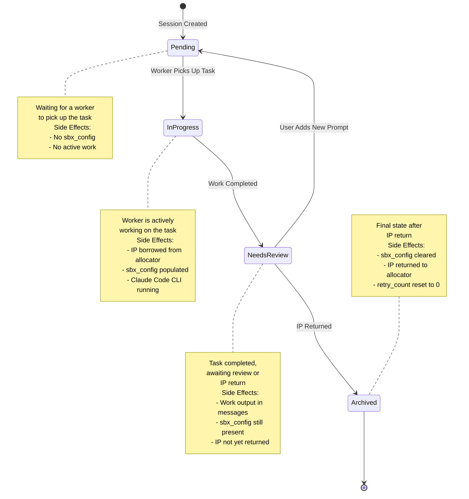

# Session UI Status State Machine

This document describes the state transitions for the `ui_status` field in sessions and their side effects.

## State Diagram



## State Transition Details

### 1. Session Created → Pending

**Trigger:** User creates a new session via API

**Location:** `src/handlers/sessions.rs`
- `create()` function (line 153-167)
- `create_with_prompt()` function (line 228-242)

**Side Effects:**
- Session record created in database
- `ui_status` set to `Pending`
- No `sbx_config` (NULL)
- Branch name generated
- Title generated (via Anthropic API)

---

### 2. Pending → InProgress

**Trigger:** Prompt poller detects pending prompt and borrows IP

**Location:** `src/bg_tasks/prompt_poller.rs`
- `poll_and_enqueue_prompts()` function (line 82-90)

**Side Effects:**
- IP borrowed from allocator
- `sbx_config` populated with:
  ```json
  {
    "item": { /* borrowed IP details */ },
    "borrow_token": "token-string"
  }
  ```
- `ui_status` set to `InProgress`
- Prompt enqueued for processing
- Prompt `inbox_status` changed from `Pending` to `Active`

---

### 3. InProgress → NeedsReview

**Trigger:** Outbox publisher completes Claude Code CLI execution

**Location:** `src/bg_tasks/outbox_publisher.rs`
- `process_outbox_job()` function (line 438-460)

**Side Effects:**
- Claude Code CLI process completes
- All output messages stored in database
- `ui_status` set to `NeedsReview`
- `sbx_config` still contains borrowed IP (not yet returned)
- Session ready for review or IP return

---

### 4. NeedsReview → Pending

**Trigger:** User adds a new prompt to the session (prompt again)

**Location:** `src/handlers/prompts.rs`
- `create()` function (line 99-107)

**Side Effects:**
- `ui_status` reset to `Pending`
- New prompt created with `inbox_status = Pending`
- Existing `sbx_config` retained (will be cleared when new IP borrowed)
- Session ready for new work cycle

**Note:** This transition allows users to iterate on their work by adding follow-up prompts.

---

### 5. NeedsReview → Archived

**Trigger:** IP return poller successfully returns the IP

**Location:** `src/bg_tasks/ip_return_poller.rs`
- `poll_and_return_ips()` function (line 103-123)

**Conditions:**
- Session has `ui_status = NeedsReview` OR `Archived`
- Session has non-null `sbx_config`
- Not already in dead letter queue

**Side Effects:**
- IP returned to allocator via API
- `sbx_config` set to NULL
- `ui_status` set to `Archived`
- `ip_return_retry_count` reset to 0
- Session finalized

**Error Handling:**
- If IP return fails, `ip_return_retry_count` incremented
- After 5 failed attempts, session moved to dead letter queue
- Retry attempts tracked with status updates

---

### 6. Archived → Archived (IP Return on Already Archived)

**Trigger:** IP return poller processes archived sessions with remaining sbx_config

**Location:** `src/bg_tasks/ip_return_poller.rs`
- `poll_and_return_ips()` function (line 32-35)

**Why This Exists:**
- Handles cases where sessions are manually archived (via API)
- Ensures IPs are always returned, even if session state changes
- Prevents IP leaks

**Side Effects:**
- Same as transition #5
- IP returned to allocator
- `sbx_config` cleared

---

## Implementation Files

| Component | File | Responsibility |
|-----------|------|----------------|
| Entity Definition | `src/entities/session.rs` | Defines `UiStatus` enum and session model |
| Session Handlers | `src/handlers/sessions.rs` | Creates sessions, handles updates |
| Prompt Handlers | `src/handlers/prompts.rs` | Creates prompts, triggers Pending transition |
| Prompt Poller | `src/bg_tasks/prompt_poller.rs` | Transitions Pending → InProgress |
| Outbox Publisher | `src/bg_tasks/outbox_publisher.rs` | Transitions InProgress → NeedsReview |
| IP Return Poller | `src/bg_tasks/ip_return_poller.rs` | Transitions NeedsReview → Archived |

---

## Database Migration

The `ui_status` field was added via migration:
- **File:** `migration/src/m20251107_000004_add_ui_status_to_session.rs`
- **Default Value:** `"pending"`
- **Type:** String (max 50 chars)
- **Not Null:** Yes

Previous fields `session_status` and `status_message` were removed via:
- **File:** `migration/src/m20251107_000005_drop_session_status_fields.rs`

---

## Background Task Schedule

| Task | Interval | Statuses Monitored |
|------|----------|-------------------|
| Prompt Poller | Every 1 second | Prompts with `inbox_status = Pending` |
| Outbox Publisher | On-demand (job queue) | N/A - processes enqueued jobs |
| IP Return Poller | Every 5 seconds | Sessions with `ui_status IN (NeedsReview, Archived)` AND `sbx_config IS NOT NULL` |

---

## API Endpoints

### Create Session
```bash
POST /sessions
# Sets ui_status = Pending
```

### Create Session with Prompt
```bash
POST /sessions/with-prompt
# Sets ui_status = Pending
# Creates initial prompt
```

### Update Session
```bash
PUT /sessions/:id
# Can manually update ui_status
# Useful for manual archiving
```

### Create Additional Prompt
```bash
POST /prompts
# If session.ui_status == NeedsReview:
#   Sets ui_status = Pending
```

---

## Error Handling: Dead Letter Queue

When IP return fails repeatedly:

1. **Retry Logic:** Up to 5 attempts with exponential backoff
2. **DLQ Insertion:** After 5th failure, session moved to DLQ
3. **DLQ Table:** `dead_letter_queue` stores failed sessions
4. **Manual Recovery:** Operators can manually retry from DLQ

**Related Files:**
- `src/services/dead_letter_queue.rs` - DLQ service
- `src/entities/dead_letter_queue.rs` - DLQ entity
- `tests/dlq_integration_test.rs` - DLQ tests
